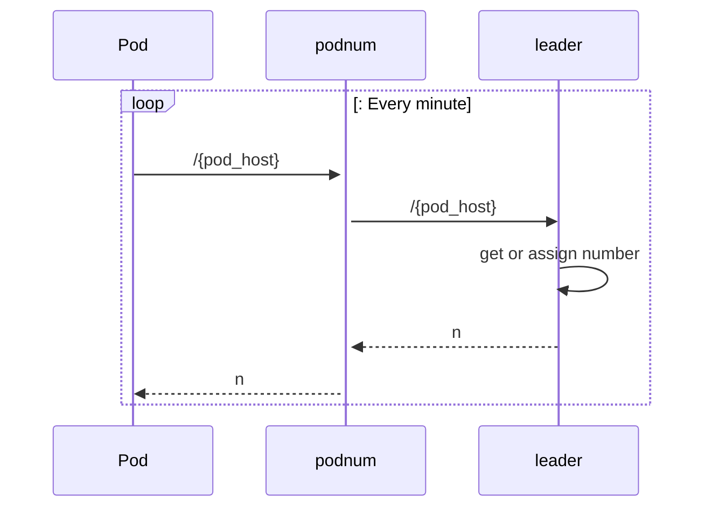

# podnum - WIP/Experimental

`podnum` is a distributed highly available service to assigns **reusable numbers** to kubernetes pods (or just applications in general). One application instance is expected to get the same `podnum` as long as it heart bits the service. If the application instance goes down, the identifier will be reused for another instance.

**It's important to highlight this is a exploratory work at the moment without urgency to become production ready.** 

## Motivation

In past companies, services were improvised to provide stable identifiers to pods, so they could use the identifiers for many purposes like metric collection.

### High cardinality tags
Having a low cardinality identifier is for applications running multiple stateless instances (like Deployments on k8s) if they use the hostname as a tag in metric collection. A high tag might not be desired for [certain monitoring cases](https://grafana.com/blog/2022/10/20/how-to-manage-high-cardinality-metrics-in-prometheus-and-kubernetes/) and might not be relevant to get a pod host name as part of metric collection.

Using `podnum` will reduce the cardinality up to the number of pods running plus the surge during rolling updates.

### Too many Kafka consumer groups
In certain Kafka scenarios like request/reply pattern, getting back a response might be challenging. One of the options is to use one consumer group per stateless application instance. The problem begins with a lot of deployments leading to consumer groups using pod names or random ids being left behind.

### Inbox pattern
It is common to use [inbox pattern](https://softwaremill.com/microservices-101/#inbox-pattern) to latter process items. To keep high throughput, applications can save data in different partitions (just a column in the database). Applications can take advantage of `podnum` to assign partitions to stateless instances to consume only partitions assigned to that node through techniques like [consistent hashing](http://highscalability.com/blog/2023/2/22/consistent-hashing-algorithm.html#:~:text=Consistent%20hashing%20is%20a%20distributed,of%20nodes%20changes%20%5B4%5D).  

Using `podnum`, developers can reduce the burden on kafka administration as lagging consumer groups are much reduced.

## How does `podnum` work?

`podnum` takes advantage of [Omnipaxos](https://omnipaxos.com/), an innovative log replication framework that helps `podnum` keeps the leased numbers highly available.

Pods (or stateless applications) after start will hit `podnum` `/{pod_host` endpoint. The reply is a plain number to be used by the application. Numbers are leased for 1 minute, if the application fails to heart bit, the number will be assigned to any new node asking for a number.
